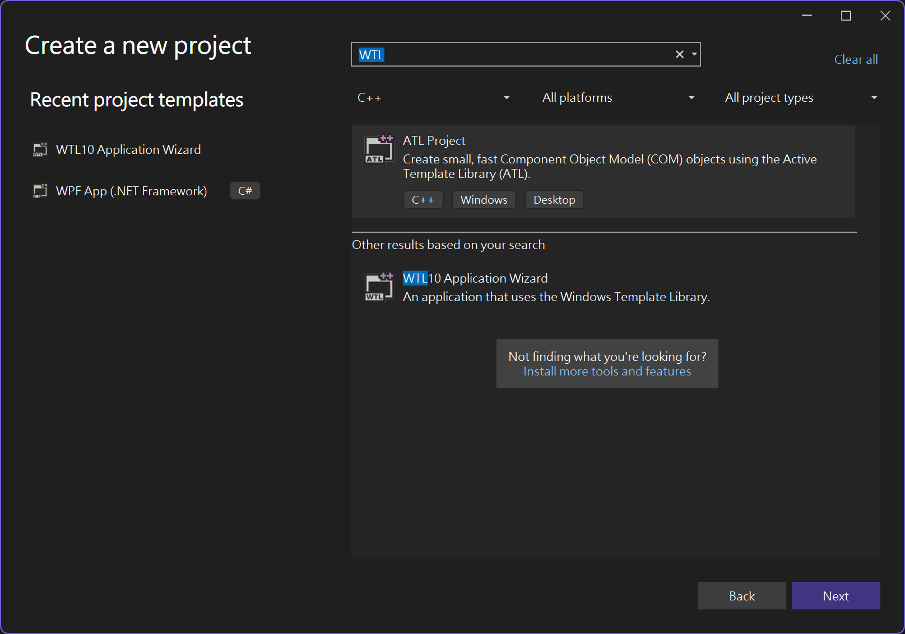

# WTL Wizard for Visual Studio 2017
## Update for WTL 10:
Since WTL 10 is released and it now supports Visual Studio 2017.
It's time to return to official WTL version. Let's enjoy WTL 10!

## Old soldiers never die; They only fade away!

Windows Template Library (WTL) is a C++ library for developing Windows applications and UI components. It extends ATL (Active Template Library) and provides a set of classes for controls, dialogs, frame windows, GDI objects, and more.

[WTL Wizard](https://github.com/allenk/WTL-Wizard-VS2017) is Visual Studio project wizard for WTL. Since current WTL built-in Setup and Wizard cannot works for latest release version of Visual Studio 2017.  The project will create a workable Setup Tool and Project Wizard for Visual Studio 2017.
The old design of WTL cannot meet new Visual Studio 2017 requirement. To solve the issue, old "Files" are cloned to "Files_15" and all updates are patched in new "Files_15" folder. The old "Files" is still kept to work for old Visual Studio.

## Update Notes
* Create Files_15 for Visual Studio 2017.
* Update Template to generate project using targetver.h.
* Old WinVER and Manifest design is removed from Files_15. 
* Setup Wizard works for Visual Studio 2017 release version.

## Version
The initiated version is based on WTL 9.1.5231 and Nuget WTL 9.1.1.
You can merge the Setup.js and Files_15 with any later version of WTL.

## ART work
* Update the old WTL 16 colors icon to New style.
* Add Visual Studio 2017 wizard style icon.

Paint with new Microsoft's 3D Paint. The BFX and 3MF 3D files are also uploaded to ArtWork folder.
Just a simple artwork. It is welcome if you could provide your great design.

## Reference
* [WTL](https://sourceforge.net/projects/wtl/)
* [Nuget WTL](https://www.nuget.org/packages/wtl/)

## Contact
 [@allenk](https://github.com/allenk)
 
